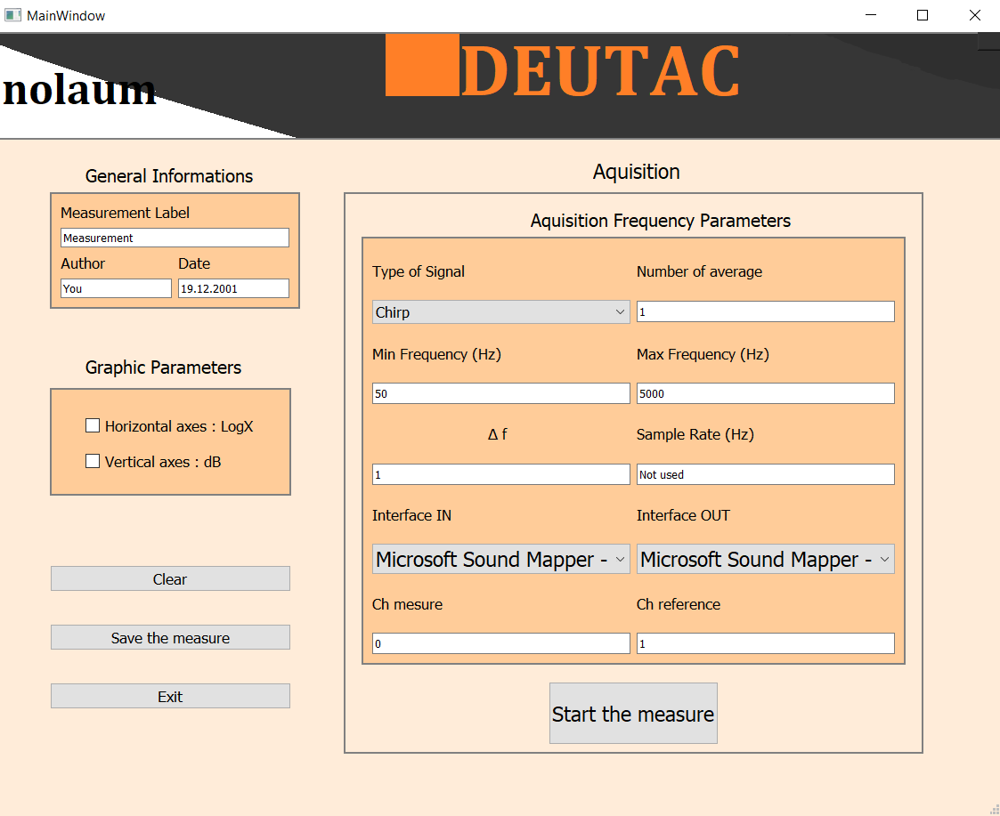

# Logiciel de mesure Audio sous Python 3.7
Ce logiciel résulte du projet du 6e semestre de la licence Acoustique et Vibration de l'Université du Mans. 
Il doit être éxécuté avec une version de python 3.7.X.

Ce logiciel est toujours en cours de développement, il est fonctionnel mais comporte certainement des erreurs.

Ce logiciel a pour objectif de déterminer la fonction de transfert H d'un filtre se représentant sous la forme:

# Interface utilisateur

L'interface se présente de la façon suivante (version non-définitive):

- <ins>Interface IN:</ins> Liste pour choisir l'interface audio d'entrée
- <ins>Interface OUT:</ins> Liste pour choisir l'interface audio de sortie
- <ins>Ch mesure:</ins> Numéro de l'entrée correspondant au signal y
- <ins>Ch référence:</ins> Numéro de l'entrée correspondant au signal x (signal de référence)
- <ins>Freq min / Freq max:</ins> Fréquence de départ et de fin du chirp
- <ins>ΔF:</ins> Pas fréquentiel
- <ins>N_avg:</ins> Nombre de moyennes
- <ins>Nom:</ins> Nom de la mesure

## Bouton Mesure

Ce bouton lance la série de mesures. Un nombre N_avg de chirp vont être joués tous séparés de 2 secondes. L'algorithme enregistre les deux cannaux en même temps dont chaque enregistrement va être stocké avant d'être moyenné pour obtenir les signaux x et y finaux.
L'algorithme va pouvoir ensuite calculer la fonction de transfert et la fonction de cohérence.

<ins>A noter :</ins> Si une seule moyenne est réalisée, la fonction de cohérence sera égale à 1 pour toute fréquence. Il est nécessaire de réaliser au moins 2 moyennes pour que la fonction de cohérence ait un sens.

## Bouton Effacer

Ce bouton permet d'effacer les courbes.

## Bouton Sauvegarder

Ce bouton permet de sauvegarder en 3 fichiers chaque mesure dans un dossier personnel dont le nom correspond au nom de la mesure donnée par l'utilisateur:

- <ins>MOD_PHASE.txt:</ins> construit de la manière suivante : Axe fréquentiel, Module de H, Phase de H
- <ins>COHERENCE.txt:</ins> construit de la manière suivante : Axe fréqentiel, fonction de coherence

Contrairement aux figures qui n'affichent que les fréquences comprisent entre [Freq min : Freq max], le fichier <ins>MOD_PHASE.txt:</ins> enregistre les fréquences entre [0 : Fs]

## Bouton Quitter

Ce bouton permet de quitter le logiciel

# Exemple de courbes

# Remerciements
Un très grand merci à Guilhem Pages.
Un grand merci à Mathis Delgado.
